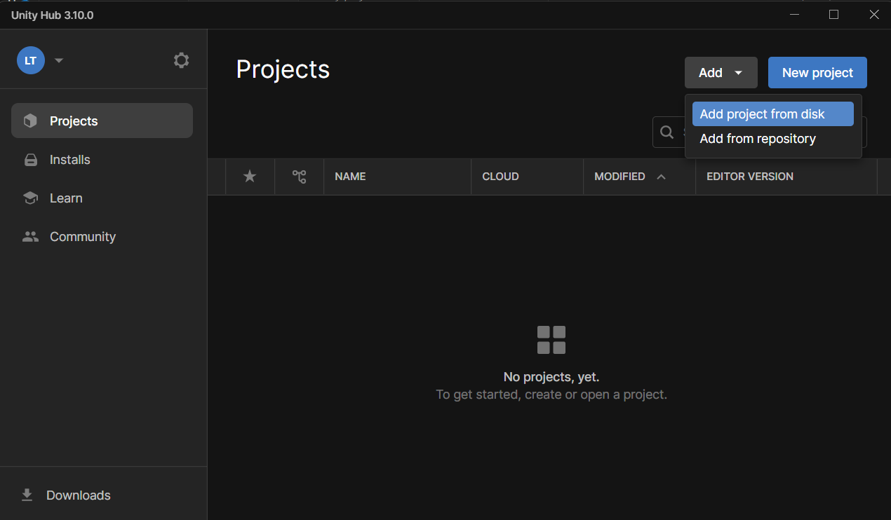
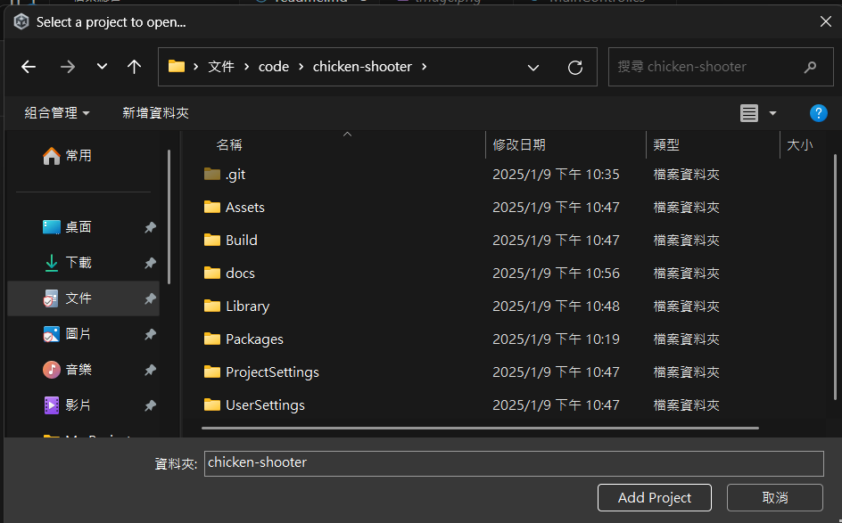
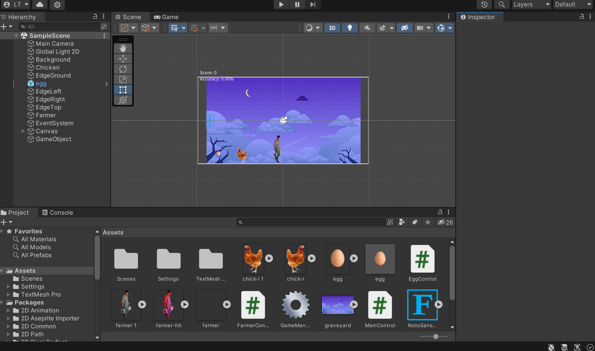
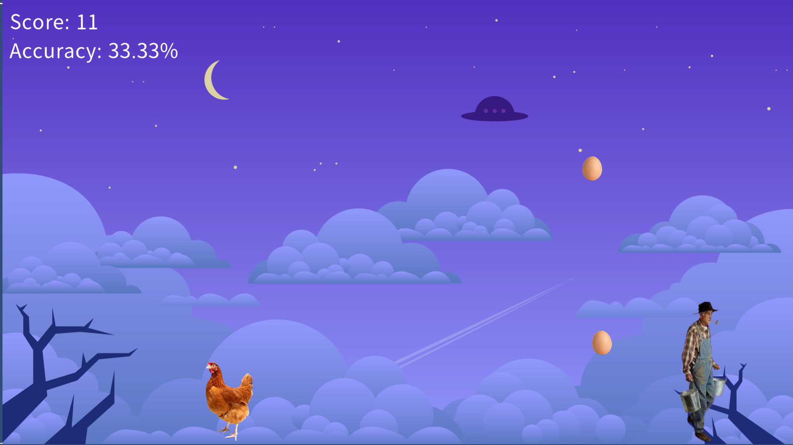

# Chicken-Shooter
Uinty期末專題小遊戲實作

## 執行
執行 `Build/My project.exe`

## 建置專案
進入 Unity Hub

選擇 Project -> Add -> Add project from desk

選擇下載壓縮後的資料夾

點擊加入的專案即可開啟

> [!WARNING]  
> 如果你還沒安裝過對應版本的編輯器(2021.3.33f1)，請在建置過程中按照步驟安裝

## 操作
`A`、`方向鍵左` - 控制雞向左走
`D`、`方向鍵右` - 控制雞向右走
`W`、`方向鍵上` - 控制雞向左走
`空白鍵`、`左鍵` - 控制雞射蛋並往上彈跳
`R` - 重製遊戲

## 遊戲畫面
